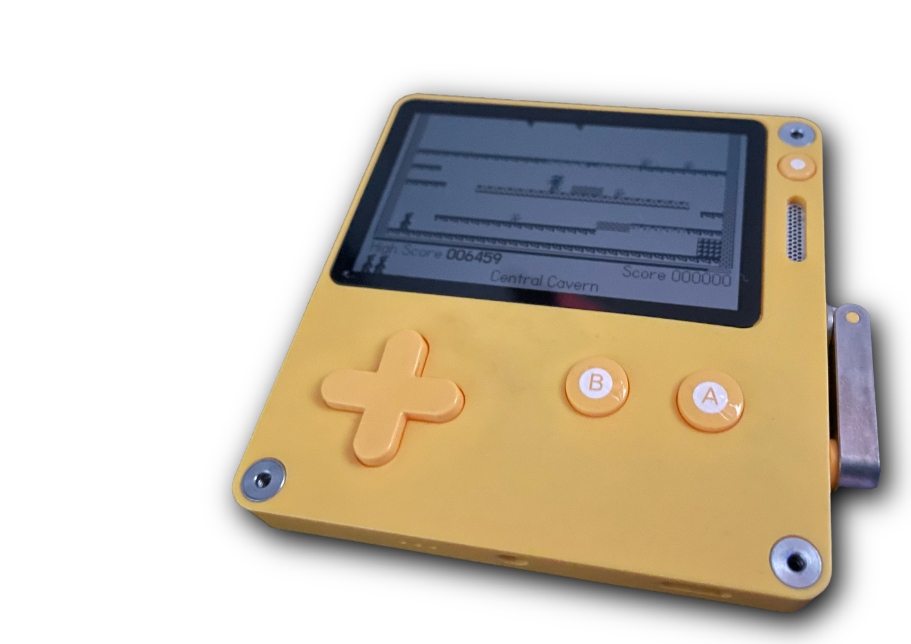
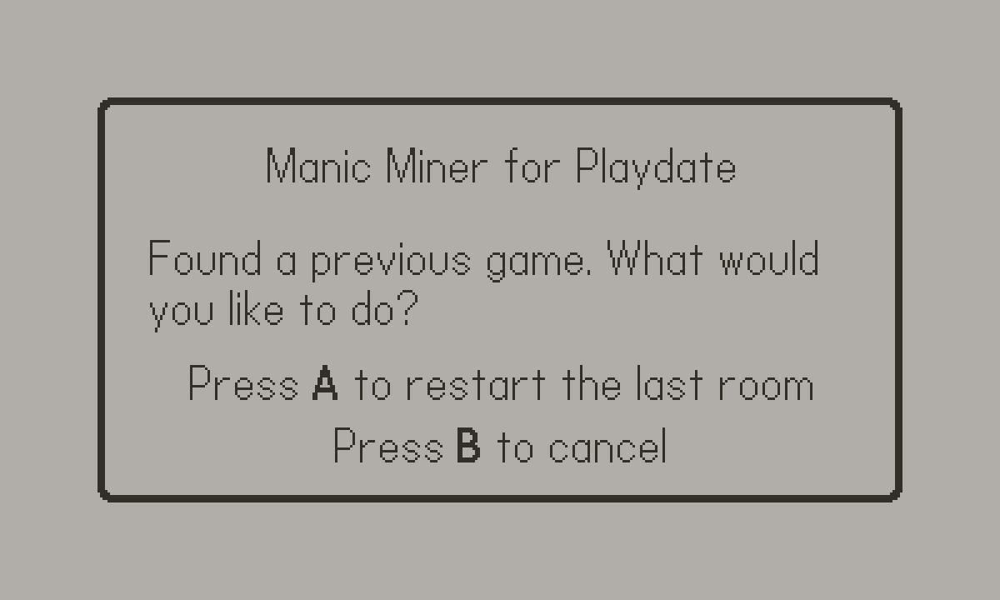

= Manic Miner Engine for Playdate Manual
:author: kounch
:revnumber: 1.0.0
:doctype: book
:notitle:
:front-cover-image: image:../img/cover.png[]
:email: kounch@users.noreply.github.com
:Revision: 1.0
:description: English Manic Miner Engine for Playdate Manual
:keywords: Manual, English, Manic Miner Engine, Playdate
:icons: font
:source-highlighter: rouge
:toc: left
:toc-title: Index
:toclevels: 4

<<<

== Introduction

[.text-center]

This is a version, created with https://www.lua.org[Lua], of the Manic Miner game engine for the handheld console https://play.date[Playdate] developed by https://panic.com/[Panic].

Manic Miner is a platform video game for ZX Spectrum, written by Matthew Smith and originally published by Bug-Byte in 1983 and later by Software Projects. Some have called it one of the most influential platform games of all time, and it has been ported to many computers, video game consoles and mobile phones among others.

== How to play

The objective of the game is to control the main character (a miner, in the original roomPack) with whom you have to go through several rooms.

You have to collect a series of objects, (shown flashing), before reaching the exit to the next room, as well as dodge enemies and traps whose contact causes instant death, which also occurs if you fall from a high altitude. In addition, the character has a limited amount of oxygen, which is gradually depleted.

For this, you have a limited number of three lives. If you lose a life, you have to try to get out of the room again from the beginning.

Once all lives are over, the game ends and, if the score obtained exceeds the previous high score, it will be recorded as a new high score record.

<<<

If the game is closed (e.g. by choosing Home from the console menu) while playing, the score obtained, the room, and the remaining lives are remembered, and, on restarting the game, the option to continue is offered, starting from the beginning of the saved room.

[.text-center]

<<<

=== Controls

==== In the main menu

[.text-center]
image:../img/menu.png[pdfwidth=48%] image:../img/black.png[pdfwidth=48%]

- *Button A:* Start Game
- *Button B:* Choose a roomPack
- *Crank:* Toggle between the two colour modes
- *Playdate menu:* Adjust the sound of the music and view the credits

<<<

==== In the roomPack selection screen

[.text-center]
image:../img/select.png[pdfwidth=80%]

- *Button A:* Load the selected package
- *Button B:* Cancel the selection and return to the main menu
- *Up and Down or Crank:* Choose a package
- *Playdate menu:* Adjust the sound of the music and view the credits

<<<

==== During a game

[.text-center]
image:../img/game.png[pdfwidth=80%]

- *Button A:* Skip
- *Left and right:* Move the character
- *Playdate menu:* Adjust the sound of the music and view the credits.

<<<

== How to install

=== Using the Playdate website

The easiest option for most people is probably to install the game wirelessly via the Playdate website. This is done as follows:

. Log in with username and password at https://play.date
. Go to the [account page]https://play.date/account
. Go to the [remote installation (sideload) page]https://play.date/account/sideload
. Drag or choose the `.pdx` game file to upload it to the web
. The game will be uploaded to the Playdate account and will be available to download to any Playdate that is linked

[NOTE]
=====
Wireless installation can only be used if you have a Playdate console registered to your online account. Otherwise, no device will appear on which to install.
=====

Next:

. Go to Settings on the Playdate console
. Select Games
. Refresh the list, and search for the previously uploaded game

<<<

=== Via USB connection (Disk mode)

You can put the Playdate console in "data disk" mode.

[WARNING]
====
By directly accessing the files, it is possible to corrupt the internal software of the console. Proceed with caution.
====

This can be done in two different ways. The first is:

. Connect the Playdate to the computer using a USB cable
. On the console, go to Settings and select the System section
. Choose "Reboot to Data Disk" and confirm

Or:

. Connect the Playdate to the computer using a USB cable
. On the Playdate console, press and hold the following three buttons at the same time: Left, Lock (top right edge of the console) and Menu (round button in the top right corner)
. Press and hold all three buttons for a few seconds, until the display shows 'Sharing DATA segment as USB drive'

In any case, after activating the data disk mode, do the following:

[start=4]
. On the computer, open the disk or volume named PLAYDATE, which will have appeared
. Open the Games folder
. Copy the `.pdx` file (not a zip file) into it
. Extract the PLAYDATE volume
. The game should now appear as available in the Playdate

<<<

=== RoomPacks

The game includes two roomPacks. One with the original game data, and one with a version with improved graphics (12x12 pixel blocks instead of the original 8x8), better adapted to the screen resolution of the Playdate.

It is possible to install new roomPacks. To do so, please follow the steps below:

. Obtain the data of the roomPack to install. This is a folder with several `.json`, `.pdt`, etc. files inside. If the data is in a compressed file, it has to be extracted as a folder before it can be used.
. Connect the Playdate to the computer using a USB cable.
. On the console, go to Settings and select the System section. Choose Reboot to Data Disk and confirm. Or, on the Playdate console, press and hold the following three buttons at the same time: Left, Lock (top right edge of the console) and Menu (round button in the top right corner), for a few seconds, until the screen displays 'Sharing DATA segment as USB drive'.
. Find inside the `Data` directory a folder with the name `com.kounch.ManicMiner` or something like `user.nnnn.ManicMiner`, depending on how the game was installed.
. Create, if necessary, a directory called `roomPacks` in that folder, and copy inside the folder with the roomPack (e.g. `Data/com.kounch.ManicMiner/roomPacks/ManicMiner2`).

If these steps have been followed correctly, the next time the game is started, it will be possible to choose the roomPack from the <<#_in_the_roompack_selection_screen,roomPack selection>> screen.

<<<

== Appendix

=== RoomPack format

A RoomPack for Playdate MM engine is comprised of the following:

- A `config.json` file with metadata like the music notes, the text to show, the name for the rest of the RoomPack files, etc.
- Several graphic image files with the main game screen, sprites for the player and enemies, as well as the tiles that are assembled to make a room in the game
- A `rooms.json` file with the layout for each of the rooms, as well as the enemies location, movement constrains, etc.
- An (optional) sound file to be played when all the rooms are finished, and before starting again with the first one

==== Converting basic RoomPack to enhanced

To convert a basic RoomPack (with original 8x8 graphics) to a enhanced one for playdate (with 12x12 graphics), you should only have to scale the corresponding sprite and image files, and then edit the main `config.json`, changing `"Scale": 1` to `"Scale": 1.5`

<<<

==== Main JSON

The main `config.json` file is an object with the following structure:

    {
    "Name":  -> Internal name for the pack
    "Scale":  -> 1 for original 8x8 ZX Spectrum graphics, 1.5 for enhanced 12x12 Playdate graphics
    "Menu":  -> Name (without extension ) of the main menu image file
    "SingleSprites":  -> Name (without extension ) of the static spritesheet table file
    "MultipleSprites":  -> Name (without extension ) of the animated spritesheet table file
    "Blocks":  -> Name (without extension ) of the room blocks imagetable file
    "Rooms":  -> Name (without extension ) of the rooms JSON file
    "TitleMusic": [
        -> Array of Arrays with [length, counter, counter] for each pair of notes of main menu tune music
        ],
    "ShowPiano": -> If true, the animation of the piano on the title screen will be shown
    "Banner": [
        -> Array of ASCII text strings to show as scrolling text after the music in the main menu screen
        ],
    "InGameMusic": [
        -> List of numbers with counter data for each note of the in-game tune
        ],
    "Special": {
        "Swordfish": -> ID in the static sprites table for the ending game image
        "Plinth":  -> ID in the static sprites table for the plinth game over image
        "Boot":  -> ID in the static sprites table for the boot game over image
        "Eugene": -> ID in the static sprites table for Eugene's sprite
        }
    }

Music notes length is converted to seconds using this formula: `seconds = 0.003625 * length`
Music counter numbers are converted to frequency (to play a note) using this formula: `freq = 440 * 109 / counter`

Since most of this information is directly mapped from the original game data structure, see [Dr. Andrew Broad Manic Miner Room-Format](https://www.icemark.com/dataformats/manic/mmformat.htm) for more information. See also [All aboard the impulse train: an analysis of the two- channel title music routine in Manic Miner](https://rke.abertay.ac.uk/ws/portalfiles/portal/8564089/McAlpine_AllAboardTheImpulseTrain_Author_2015.pdf) for an explanation of how the original game music is made and encoded.

<<<

==== Rooms JSON

The rooms JSON file is a list of objects, each one of them with the following structure:

    {
    "data": [
        -> An array of 16 text strings, each one of them made by 32 1-byte hexadecimal numbers, representint the attribute
           of a tile in the room.
        ],
    "id": -> Unique number for each room used, for example, to get the image tile from the block images file
    "name": -> Name of the room, shown down the in-game screen
    "special": {
        -> If it contains "Eugene", "Kong, "Skylab" or "Solar" apply the corresponding special rules for this room
        },
    "attr": -> String made by 8 1-byte hexadecimal numbers, each one corresponding to the attribute that maps to 
               the corresponding tile for this room, and is being used in the "data" property above.
    "HGuardians": [
        {
            "attr": -> Used to calculate a horizontal guardian's starting face (left or right) and speed
            "addr": -> Address used to calculate a guardian maximum and minimum coordinates
            "location": -> Start location of guardian on screen
            "frame": -> Start animation fram for guardian
            "min": -> Limit to guardian movement
            "max": -> Limit to guardian movement
            }
        ],
    "start": {
        "left": -> Starting face for the player (left or right)
        "addr": -> Starting position for the player
        },
    "conveyor": {
        "left": -> Conveyor direction
        "addr": -> Unused
        },
    "items": [
        -> List with up to five locations on screen for key items
        ],
    "portal": {
        "id": -> Index in the static sprites image table for the door image
        "addr": -> Location on screen of the door
        },
    "VGuardians": [
            "attr": -> Unused
            "frame": -> Start animation frame for this vertical guardian
            "start": -> Used to calculate the starting coordinates
            "location": -> Used to calculate the starting coordinates
            "dy": -> Indicates if the movement starts upwards or downwards and the speed
            "min": -> Limit to guardian movement
            "max": -> Limit to guardian movement 
        ]
    }

Since most of this information is directly mapped from the original game data structure, see [Dr. Andrew Broad Manic Miner Room-Format](https://www.icemark.com/dataformats/manic/mmformat.htm) for more information.

==== Image Data

All the image files should be 1-bit with optional transparency (specially for sprite images)

===== Main Image

The main image shown in the main game menu, and its top third is also merged with the last room room layout ("The Final Barrier" in the original game). It can be of any size up to 384x192 pixels (bigger images will be cropped) and does not need any transparency since it will always be drawn behind everything else.

===== Sprites

Depending on the scale, the sprite images can be 16x16 pixels or 24x24 pixels in size. There are two files:

- Static (single) sprites: the portal doors, Eugene, the game over screen boot and plinth, etc.
- Animated (multiple) sprites: These are in groups of 4 or 8 images (when bidirectional), and the first eight are always used for the player (Willy) graphics

Bidirectional graphics use Sprites 1 to 4 for the right-facing frames and Sprites 7 to 8 for the left-facing frames, where Sprites 1 and 5 are the leftmost frames, and Sprites 4 and 8 are the rightmost frames. There is an exception for graphics used in "Skylab" rooms where the first image is used for movement and the remaining seven are used for a destruction effect at the end.

See [Dr. Andrew Broad Manic Miner Room-Format](https://www.icemark.com/dataformats/manic/mmformat.htm) for more information.

For the original game, there are 24 static sprites and 168 animated sprites.

Sprite images should use transparency for their background or else strange artifacts will happen.

<<<

===== Blocks

Depending on the scale, the block images can be 8x8 pixels or 12x12 pixels in size. They are stored in groups of 9, and there is one group for each of the rooms, so the original game has 180 images.

For each group each of the block images is used for a different block type or element, with the following order:

1. Background
2. Floor
3. Crumbling Floor
4. Wall
5. Conveyor
6. Nasty 1
7. Nasty 2
8. Spare
9. Key Item

The spare type is used for switches, extra floor or other.

See [Dr. Andrew Broad Manic Miner Room-Format](https://www.icemark.com/dataformats/manic/mmformat.htm) for more information.

==== Sound Data

The source for the optional ending sound should be an ADPCM encoded WAV (Microsoft) sound file. See [The official Playdate docs](https://sdk.play.date/1.13.7/Inside%20Playdate.html#M-sound) for more information.

<<<

== License

BSD 2-Clause License

Copyright (c) 2022-2023, kounch
All rights reserved.

Redistribution and use in source and binary forms, with or without
modification, are permitted provided that the following conditions are met:

- Redistributions of source code must retain the above copyright notice, this
  list of conditions and the following disclaimer.

- Redistributions in binary form must reproduce the above copyright notice,
  this list of conditions and the following disclaimer in the documentation
  and/or other materials provided with the distribution.

THIS SOFTWARE IS PROVIDED BY THE COPYRIGHT HOLDERS AND CONTRIBUTORS "AS IS"
AND ANY EXPRESS OR IMPLIED WARRANTIES, INCLUDING, BUT NOT LIMITED TO, THE
IMPLIED WARRANTIES OF MERCHANTABILITY AND FITNESS FOR A PARTICULAR PURPOSE ARE
DISCLAIMED. IN NO EVENT SHALL THE COPYRIGHT HOLDER OR CONTRIBUTORS BE LIABLE
FOR ANY DIRECT, INDIRECT, INCIDENTAL, SPECIAL, EXEMPLARY, OR CONSEQUENTIAL
DAMAGES (INCLUDING, BUT NOT LIMITED TO, PROCUREMENT OF SUBSTITUTE GOODS OR
SERVICES; LOSS OF USE, DATA, OR PROFITS; OR BUSINESS INTERRUPTION) HOWEVER
CAUSED AND ON ANY THEORY OF LIABILITY, WHETHER IN CONTRACT, STRICT LIABILITY,
OR TORT (INCLUDING NEGLIGENCE OR OTHERWISE) ARISING IN ANY WAY OUT OF THE USE
OF THIS SOFTWARE, EVEN IF ADVISED OF THE POSSIBILITY OF SUCH DAMAGE.

Manic Miner Copyright 1983 Matthew Smith.

Playdate is a registered trademark of [Panic](https://panic.com/).

