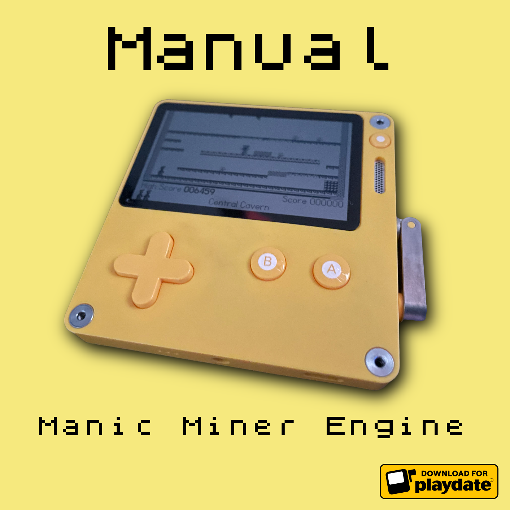
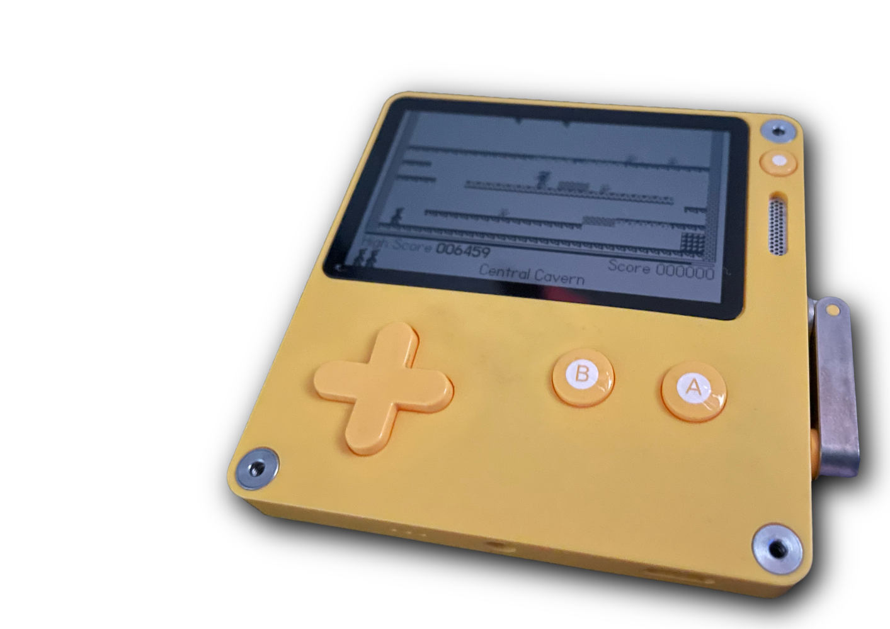
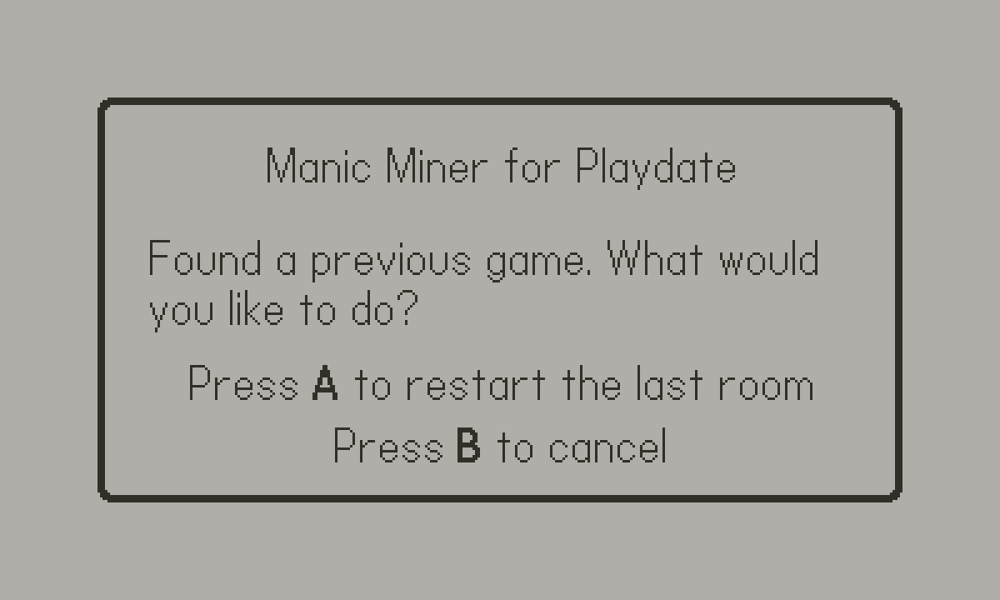
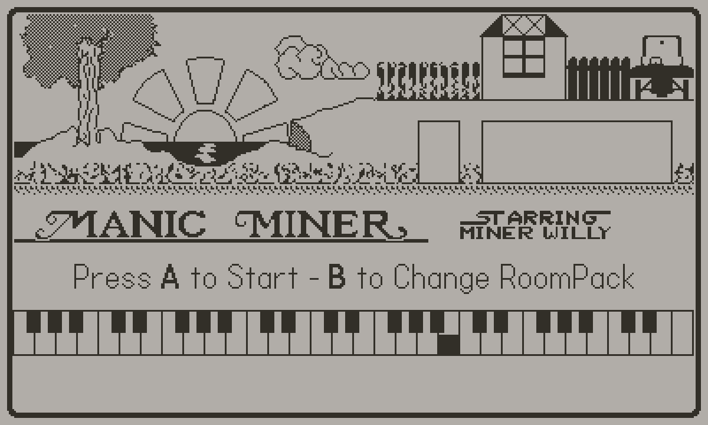
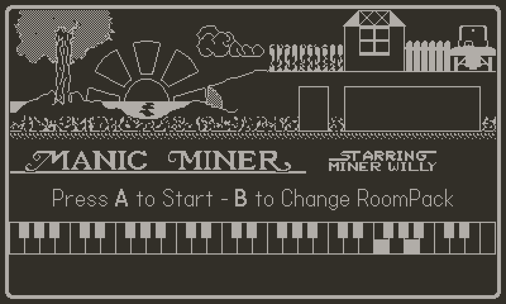
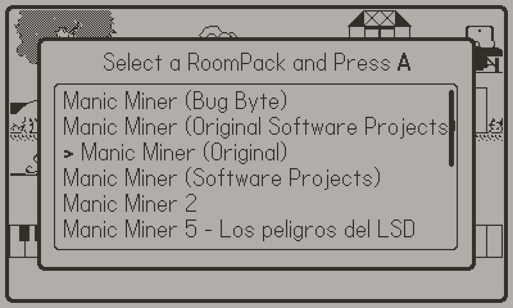
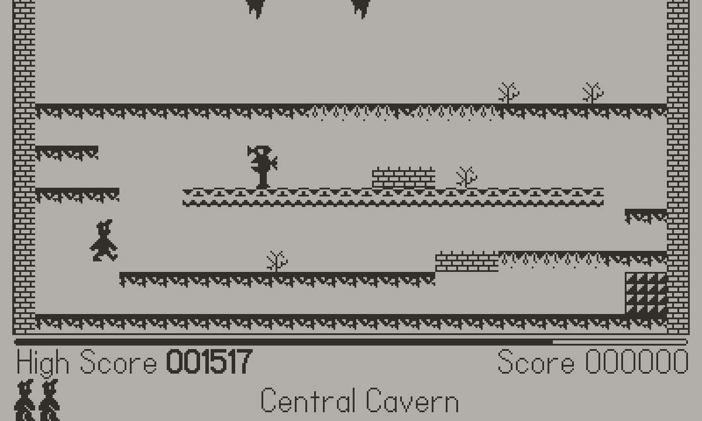

= Manual de Manic Miner Engine para Playdate
:author: kounch
:revnumber: 1.0.0
:doctype: book
:notitle:
:front-cover-image: 
:email: kounch@users.noreply.github.com
:Revision: 1.0
:description: Manual en Castellano de Manic Miner Engine para Playdate
:keywords: Manual, Castellano, Manic Miner Engine, Playdate
:icons: font
:source-highlighter: rouge
:toc: left
:toc-title: Índice
:toclevels: 4

<<<

== Introducción

[.text-center]

Esta es una versión del motor del juego Manic Miner, creado con https://www.lua.org[Lua], para la consola portátil https://play.date[Playdate] desarrollada por https://panic.com/[Panic].

Manic Miner es un videojuego de plataformas para ZX Spectrum, escrito por Matthew Smith y publicado originalmente por Bug-Byte en 1983 y luego por Software Projects. Algunos lo han calificado como uno de los juegos de plataformas más influyentes de todos los tiempos, y ha sido portado a muchos ordenadores, consolas de videojuegos y teléfonos móviles entre otros.

== Cómo jugar

El objetivo del juego es controlar al personaje principal (un minero, en el paquete de habitaciones original) con el cual hay que recorrer varias salas o habitaciones.

Es necesario reunir una serie de objetos, que se distinguen por estar parpadeando, antes de alcanzar la salida que permitirá pasar a la siguiente sala, así como esquivar enemigos y trampas cuyo contacto provoca la muerte instantánea, muerte que también se produce si se cae desde una altura elevada. Además, el personaje dispone de una cantidad limitada de oxígeno que se va agotando poco a poco.

Para ello se dispone de un número limitado de tres vidas. Al perder una vida, se tiene que volver a intentar salir de la sala desde el principio.

Una vez se terminan todas las vidas, finaliza la partida y, si la puntuación obtenida supera al máximo anterior, quedará registrada como nuevo récord.

<<<

Si se cierra el juego (por ejemplo, eligiendo Home desde el menú de la consola) durante una partida, se recuerda la puntuación obtenida, la sala, y las vidas restantes, y, al volver a iniciarlo, se ofrece la posibilidad de continuar, comenzando desde el principio la habitación en la que se encontraba.

[.text-center]

<<<

=== Controles

==== En el menú principal

[.text-center]
 

- *Botón A:* Comenzar Juego
- *Botón B:* Elegir un paquete de habitaciones
- *Manivela:* Alternar entre los dos modos de color
- *Menú de Playdate:* Ajustar el sonido de la música y ver los créditos

<<<

==== En la selección de paquetes de habitaciones

[.text-center]

- *Botón A:* Cargar el paquete seleccionado
- *Botón B:* Cancelar la selección y volver al menú principal
- *Arriba y abajo o bien la Manivela:* Elegir un paquete
- *Menú de Playdate:* Ajustar el sonido de la música y ver los créditos

<<<

==== Durante una partida

[.text-center]

- *Botón A:* Saltar
- *Izquierda y derecha:* Mover al personaje
- *Menú de Playdate:* Ajustar el sonido de la música y ver los créditos

<<<

== Instalación

=== Usando el sitio web de Playdate

La opción más sencilla para la mayoría de la gente seguramente sea instalar el juego de forma inalámbrica a través del sitio web de Playdate. Esto se hace de la siguiente manera:

. Acceder con usuario y contraseña en https://play.date
. Ir a la [página de la cuenta (account)]https://play.date/account
. Ir a la página de [instalación remota (sideload)]https://play.date/account/sideload
. Arrastrar o elegir el archivo de juego `.pdx` para subirlo a la web
. El juego se cargará en la cuenta de Playdate y estará disponible para cualquier Playdate que esté vinculada

[NOTE]
=====
La instalación inalámbrica sólo se puede usar si se dispone de una consola Playdate registrada en la cuenta online. De no ser así, no aparecerá un dispositivo donde realizar la instalación.
=====

A continuación:

. Acceder a Configuración (Settings) en la consola Playdate
. Seleccionar Juegos (Games)
. Actualizar la lista (Refresh), y buscar el juego subido anteriormente

<<<

=== A través de una conexión USB (modo Disco)

Se puede poner la consola Playdate en el modo "disco de datos".

[WARNING]
====
Al acceder directamente a los archivos, es posible estropear el software interno de la consola. Proceder con cautela.
====

Esto se puede hacer de dos formas diferentes. La primera es:

. Conectar la Playdate al ordenador mediante un cable USB
. En la consola, acceder a Configuración (Settings) y elegir la sección del Sistema (System)
. Elegir Reiniciar a Disco de Datos (Reboot to Data Disk) y confirmar

O bien:

. Conectar la Playdate al ordenador mediante un cable USB
. En la consola Playdate, mantener pulsados los tres botones siguientes al mismo tiempo: Izquierda, Bloquear (borde superior de la consola) y Menú (botón redondo en la esquina superior derecha)
. Mantener pulsados los tres botones durante unos segundos, hasta que en la pantalla aparezca `Sharing DATA segment as USB drive.`

En cualquier caso, tras activar el modo disco de datos, se ha de hacer lo siguiente:

[start=4]
. En el ordenador, abrir el disco o volumen llamado PLAYDATE, que habrá aparecido
. Abrir la carpeta Juegos (Games)
. Copiar el fichero `.pdx` (no un archivo zip) dentro
. Extraer el volumen PLAYDATE
. El juego debería aparecer ahora como disponible en la Playdate

<<<

=== Paquetes de habitaciones

El juego incluye de serie dos paquetes de habitaciones. Uno con los datos de juego originales, y otro con una versión con gráficos mejorados (bloques de 12x12 pixeles en vez de los 8x8 originales) mejor adaptados a la resolución de pantalla de la Playdate.

Es posible instalar nuevos paquetes de habitaciones. Para ello, se han de seguir los siguientes pasos:

. Obtener los datos del paquete de habitaciones a instalar. Estos consisten en una carpeta con varios ficheros `.json`, `.pdt`, etc. Si los datos están en un fichero comprimido, se han de extraer como carpeta antes de poder utilizarlos
. Conectar la Playdate al ordenador mediante un cable USB.
. En la consola, acceder a Configuración (Settings) y elegir la sección del Sistema (System). Elegir Reiniciar a Disco de Datos (Reboot to Data Disk) y confirmar. O bien, en la consola Playdate, mantener pulsados los tres botones siguientes al mismo tiempo: Izquierda, Bloquear (borde superior de la consola) y Menú (botón redondo en la esquina superior derecha), durante unos segundos, hasta que en la pantalla aparezca `Sharing DATA segment as USB drive.`.
. Identificar en el directorio `Data` una carpeta con el nombre `com.kounch.ManicMiner` o bien algo como `user.nnnn.ManicMiner`, según cómo se haya instalado el juego.
. Crear, si fuera necesario, un directorio llamado `roomPacks` en esa carpeta, y copiar la carpeta con el paquete de habitaciones en su interior. (Por ejemplo: `Data/com.kounch.ManicMiner/roomPacks/ManicMiner2`)

Si se han seguido estos pasos correctamente, la próxima vez que se inicie el juego, será posible elegir el paquete de habitaciones desde el menú de <<#_en_la_selección_de_paquetes_de_habitaciones,selección de paquetes de habitaciones>>.

<<<

== Apéndice

=== Formato de un paquete de habitaciones

Un paquete habitaciones del motor MM para Playdate se compone de lo siguiente:

- Un archivo `config.json` con metadatos como las notas musicales, el texto a mostrar, el nombre para el resto de archivos del paquete, etc.
- Varios archivos de imágenes gráficas con la pantalla principal del juego, sprites del personaje principal y los enemigos, así como los bloques que se usan para formar una habitación en el juego.
- Un archivo `rooms.json` con la distribución de cada una de las habitaciones, así como la ubicación de los enemigos, las restricciones de movimiento, etc.
- Un archivo de sonido (opcional) que se reproducirá cuando todas se supere la habitación final, y antes de empezar de nuevo con la primera.

==== Conversión de un paquete de habitaciones básico a mejorado

Para convertir un paquete de habitaciones básico (con gráficos originales 8x8) en uno mejorado para playdate (con gráficos 12x12), debería ser suficiente con escalar los archivos de sprites e imágenes correspondientes al tamaño adecuado, y luego editar el archivo principal `config.json`, cambiando `"Scale": 1` por `"Scale": 1.5`

<<<

==== JSON principal

El archivo principal `config.json` es un objeto con la siguiente estructura:

[source]
----
{
    "Name  -> Nombre interno del pack
    "Scale":  -> 1 para gráficos originales (8x8) de ZX Spectrum, 1.5 para gráficos mejorados (12x12) de Playdate
    "Menu":  -> Nombre (sin extensión ) del archivo de imagen del menú principal
    "SingleSprites":  -> Nombre (sin extensión ) del archivo de tabla de sprites estáticos
    "MultipleSprites":  -> Nombre (sin extensión ) del archivo de tabla de la hoja de sprites animados
    "Blocks":  -> Nombre (sin extensión ) del archivo de tabla de imágenes de los bloques de la sala
    "Rooms": -> Nombre (sin extensión ) del archivo JSON de las habitaciones
    "TitleMusic": [
        -> Array de Arrays con [longitud, contador, contador] para cada par de notas de la música del menú principal
    ],
    "ShowPiano": -> Si es true, se mostrará la animación del piano en la pantalla de título.
    "Banner": [
        -> Array de cadenas de texto ASCII para mostrar después de la música en la pantalla del menú principal
    ],
    "InGameMusic": [
        -> Lista de números con datos de contador para cada nota de la melodía del juego
    ],
    "Special": {
        "Swordfish": -> ID en la tabla estática de sprites para la imagen final del juego
        "Plinth":  -> ID en la tabla estática de sprites para la columna de fin de partida
        "Boot":  -> ID en la tabla estática de sprites para la bota de fin de partida
        "Eugene": -> ID en la tabla estática de sprites para el sprite de Eugene
    }
}
----

La duración de las notas musicales se convierte en segundos mediante esta fórmula: `segundos = 0,003625 * duración`
Los números del contador de música se convierten a frecuencias (para tocar una nota) mediante esta otra fórmula: `frecuencia = 440 * 109 / contador`

Dado que la mayor parte de esta información está directamente obtenida desde la estructura de datos original del juego, véase https://www.icemark.com/dataformats/manic/mmformat.htm[Dr. Andrew Broad Manic Miner Room-Format] para más información. Véase también https://rke.abertay.ac.uk/ws/portalfiles/portal/8564089/McAlpine_AllAboardTheImpulseTrain_Author_2015.pdf[All aboard the impulse train: an analysis of the two- channel title music routine in Manic Miner] para una explicación de cómo se hace y codifica la música original del juego.

<<<

==== Fichero de habitaciones JSON

El fichero JSON de las habitaciones es una lista de objetos, cada uno de ellos con la siguiente estructura:

[source]
----
{
    "data": [
        -> Un array de 16 cadenas de texto, cada una de ellas formada por 32 números hexadecimales de 1 byte, que representan el atributo de un bloque en la habitación.
        ],
    "id": -> Número único para cada habitación. utilizado, por ejemplo, para obtener la imagen del bloque correspondiente desde el 
             archivo de imágenes.
    "name": -> Nombre de la habitación, que se muestra abajo en la pantalla del juego
    "special": {
        -> Si contiene "Eugene", "Kong", "Skylab" o "Solar" aplica las reglas especiales correspondientes para esta sala
        },
    "attr": -> Cadena formada por 8 números hexadecimales de 1 byte, cada uno correspondiente al atributo que mapea a 
               el bloque correspondiente para esta sala, y se está utilizando en la propiedad "data" anterior.
    "HGuardians": [
        {
            "attr": -> Se usa para calcular la orientación inicial (izquierda o derecha) y la velocidad de un guardián horizontal
            "addr": -> Dirección utilizada para calcular las coordenadas máximas y mínimas de un guardián
            "location": -> Ubicación inicial del guardián en la pantalla
            "frame": -> Frame de inicio de la animación del guardián
            "min": -> Límite de movimiento del guardián
            "max": -> Límite de movimiento del guardián
        }
    ],
    "start": {
        "izquierda": -> Orientación de inicio para el personaje del jugador (izquierda o derecha).
        "addr": -> Posición inicial para el personaje del jugador
    },
    "conveyor": {
        "left": -> Dirección del transportador
        "addr": -> No utilizado
    },
    "items": [
        -> Lista con hasta cinco ubicaciones en pantalla para los objetos llave
    ],
    "portal": {
        "id": -> Índice en la tabla de imágenes estáticas de sprites para la imagen de la puerta
        "addr": -> Ubicación en pantalla de la puerta
    },
    "VGuardians": [
            "attr": -> Sin usar
            "frame": -> Frame de inicio de la animación para este guardián vertical
            "start": -> Se utiliza para calcular las coordenadas de inicio
            "location": -> Se utiliza para calcular las coordenadas de inicio
            "dy": -> Indica si el movimiento comienza hacia arriba o hacia abajo, y la velocidad
            "min": -> Límite del movimiento del guardián
            "max": -> Límite del movimiento del guardián 
    ]
}
----

Dado que la mayor parte de esta información se extrae directamente de la estructura de datos original del juego, consulte https://www.icemark.com/dataformats/manic/mmformat.htm[Dr. Andrew Broad Manic Miner Room-Format] para obtener más información sobre la misma.

==== Datos de imágenes

Todos los archivos de imagen deben ser de 1 bit con transparencia opcional (especialmente para imágenes de sprites)

===== Imagen principal

La imagen que se muestra en el menú principal del juego, y cuyo tercio superior también se fusiona con el diseño de la sala de la última habitación ("The final barrier" en el juego original). Puede ser de cualquier tamaño hasta 384x192 píxeles (las imágenes más grandes se recortarán) y no necesita ninguna transparencia ya que siempre se dibujará detrás de todo lo demás.

===== Archivos de Sprites

Dependiendo de la escala, las imágenes de los sprites pueden tener un tamaño de 16x16 píxeles o 24x24 píxeles. Existen dos archivos:

- Sprites estáticos (individuales): las puertas del portal, Eugene, la bota y la columna de fin de juego, etc.
- Sprites animados (múltiples): Se presentan en grupos de 4 u 8 imágenes (cuando son bidireccionales), y los ocho primeros se utilizan siempre para los gráficos del jugador (Willy).

Los gráficos bidireccionales utilizan los Sprites 1 a 4 para los frames que miran hacia la derecha y los Sprites 7 a 8 para los frames que miran hacia la izquierda, donde los Sprites 1 y 5 son los frames más a la izquierda, y los Sprites 4 y 8 son los frames más a la derecha. Existe una excepción en los gráficos utilizados en las salas "Skylab", donde la primera imagen se utiliza para el movimiento y las siete restantes para un efecto de destrucción al final.

Véase https://www.icemark.com/dataformats/manic/mmformat.htm[Dr. Andrew Broad Manic Miner Room-Format] para más información.

Así, en el juego original, hay 24 sprites estáticos y 168 animados.

Las imágenes de los sprites deben usar transparencia en el fondo o de lo contrario se producirán artefactos extraños.

===== Bloques

Dependiendo de la escala, las imágenes de los bloques pueden tener un tamaño de 8x8 píxeles o 12x12 píxeles. Se almacenan en grupos de 9, y hay un grupo por cada habitación, por lo que el juego original tiene 180 imágenes.

En cada grupo, cada una de las imágenes se utiliza para un tipo de bloque o elemento diferente, con el siguiente orden:

. Fondo
. Suelo
. Suelo que se rompe
. Muro
. Transportador
. Mortal 1
. Mortal 2
. Repuesto
. Objeto llave

El tipo de repuesto (8) se utiliza para interruptores, piso extra u otros.

Ver https://www.icemark.com/dataformats/manic/mmformat.htm[Dr. Andrew Broad Manic Miner Room-Format] para más información.

==== Datos de Sonido

La fuente para el sonido final opcional debe ser un archivo de sonido WAV (Microsoft) codificado con ADPCM. Véase https://sdk.play.date/1.13.7/Inside%20Playdate.html#M-sound[la documentación oficial de Playdate] para más información.

<<<

== Copyright

BSD 2-Clause License

Copyright (c) 2022-2023, kounch
All rights reserved.

Redistribution and use in source and binary forms, with or without
modification, are permitted provided that the following conditions are met:

- Redistributions of source code must retain the above copyright notice, this
  list of conditions and the following disclaimer.

- Redistributions in binary form must reproduce the above copyright notice,
  this list of conditions and the following disclaimer in the documentation
  and/or other materials provided with the distribution.

THIS SOFTWARE IS PROVIDED BY THE COPYRIGHT HOLDERS AND CONTRIBUTORS "AS IS"
AND ANY EXPRESS OR IMPLIED WARRANTIES, INCLUDING, BUT NOT LIMITED TO, THE
IMPLIED WARRANTIES OF MERCHANTABILITY AND FITNESS FOR A PARTICULAR PURPOSE ARE
DISCLAIMED. IN NO EVENT SHALL THE COPYRIGHT HOLDER OR CONTRIBUTORS BE LIABLE
FOR ANY DIRECT, INDIRECT, INCIDENTAL, SPECIAL, EXEMPLARY, OR CONSEQUENTIAL
DAMAGES (INCLUDING, BUT NOT LIMITED TO, PROCUREMENT OF SUBSTITUTE GOODS OR
SERVICES; LOSS OF USE, DATA, OR PROFITS; OR BUSINESS INTERRUPTION) HOWEVER
CAUSED AND ON ANY THEORY OF LIABILITY, WHETHER IN CONTRACT, STRICT LIABILITY,
OR TORT (INCLUDING NEGLIGENCE OR OTHERWISE) ARISING IN ANY WAY OUT OF THE USE
OF THIS SOFTWARE, EVEN IF ADVISED OF THE POSSIBILITY OF SUCH DAMAGE.

Manic Miner Copyright 1983 Matthew Smith.

Playdate is a registered trademark of https://panic.com/[Panic].
